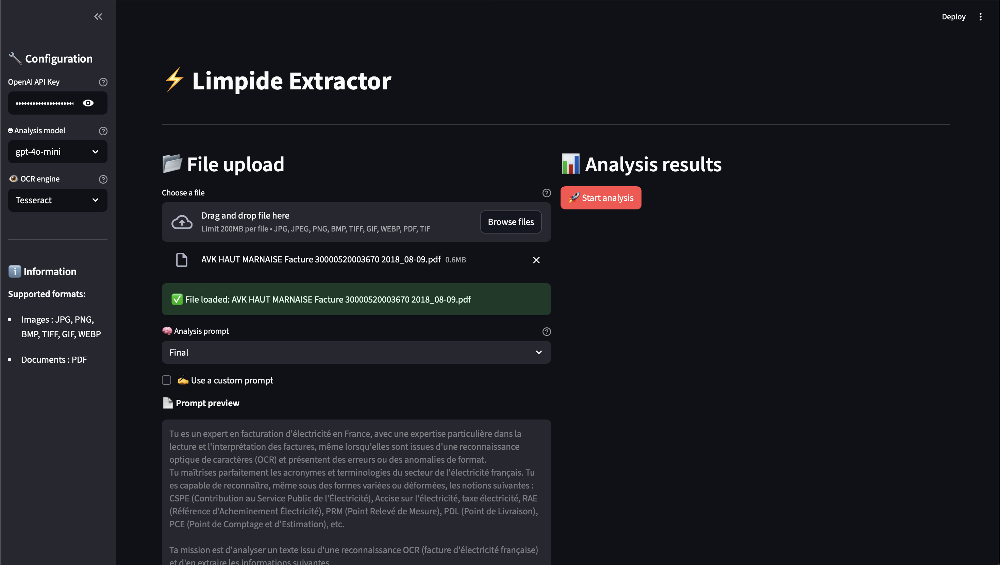

# Autogen - Installation

---

## :zap: Quick Start

- Project context: This interface will help you extract information from every document you need to given a prompt and json extraction template for visualization. It uses different Open-source OCR and OpenAI API key to extract the result from the text.

- Prepare
  - Activate your venv (or create one):
    - macOS/Linux: `source .venv/bin/activate`
    - Windows (PowerShell): `.venv\Scripts\Activate`
  - Install deps: `pip install -r requirements.txt`

- Run UI
  - `python app/run_app.py` → http://localhost:8501


## :rocket: Launch the app

For the **Streamlit** interface:
```bash
python app/run_app.py
```
<p align="center">
  
</p>

## Project Structure

```bash

  ├── resources
  |  ├── prompts.py # Contains the prompts in dict
  |  └── OCR.py # Centralize OCR method
  |
  ├── autogen3.13 - virtual env
  |
  ├── results - local db to temporarily store results
  |  ├── XXX.json # extraction results
  |  ├── XXX.txt # OCR extraction results
  |  └── XXX.prompt # Prompt used
  |
  ├── app - Streamlit interface application
  |  ├── run_app.py # Launch to run the app, check the needs
  |  └── streamlit_app.py # Application definition
  |
  └── requirements.txt # Library resources
  └── README.md # Explanation and information
```

## :snake: Python Setup with Pyenv

### :hand: Virtual Environment

**Set** the python version with pyenv
```bash
pyenv install 3.13

pyenv local 3.13
```

**Add** to PATH (if not already done):
```bash
echo 'export PYENV_ROOT="$HOME/.pyenv"' >> ~/.zshrc
echo 'export PATH="$PYENV_ROOT/bin:$PATH"' >> ~/.zshrc
echo 'eval "$(pyenv init --path)"' >> ~/.zshrc
echo 'eval "$(pyenv init -)"' >> ~/.zshrc
source ~/.zshrc
```

> It will create the .python-version containing the following version

**Create** the virtual environment with :
```bash
py -3.13 -m venv .venv #Name whatever you want
```

>Try to use the most recent of python, I tried to use an older version and got the a different interface with less options.

**Activate** the virtual environment :
```bash
.venv\Scripts\activate # On Windows
or
source .venv/bin/activate # On macOS/Linux
```
> If it worked you should see in your console something like :
> ```bash
> (.venv) PS C:\Users\admin\Documents\limpide autogen>
> ```
>The (...) specify your python environment

And now you should be able to select the environment in your IDE

**Select it** in VS code/Cursor :
 - Open Command Palette (Ctrl + Shift + P)
 - Type ```>Python : Select Interpreter```
- Select your environment (e.g : ```.venv```)

### :books: Install Dependencies
Install project dependencies:
```bash
pip install -r requirements.txt

# Try this if failed on autogen-agenchat
pip install -U "autogen-agentchat" "autogen-ext[openai]"
```

## :wrench: System Prerequisites (OCR)
- Tesseract OCR (with English + French models):
  - macOS: `brew install tesseract tesseract-lang`
  - Ubuntu/Debian: `sudo apt-get install tesseract-ocr tesseract-ocr-fra tesseract-ocr-eng`
  - Windows: installer from the UB Mannheim page
- Poppler (for `pdf2image` PDF rendering):
  - macOS: `brew install poppler`
  - Ubuntu/Debian: `sudo apt-get install poppler-utils`

## Self Host LLM
You can self host your model via Ollama or Lmstudio if you need UI.
I will maybe add it.